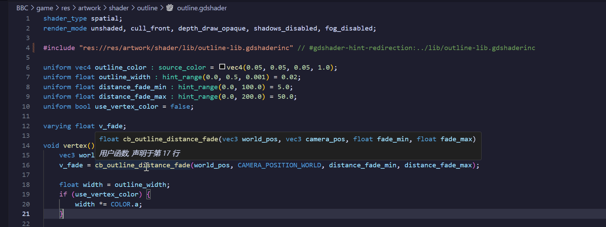
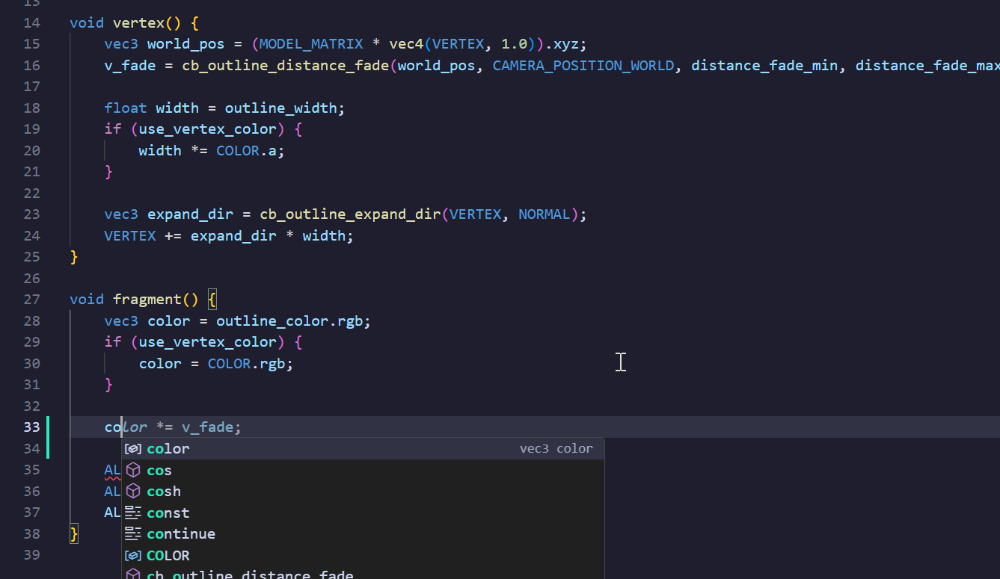
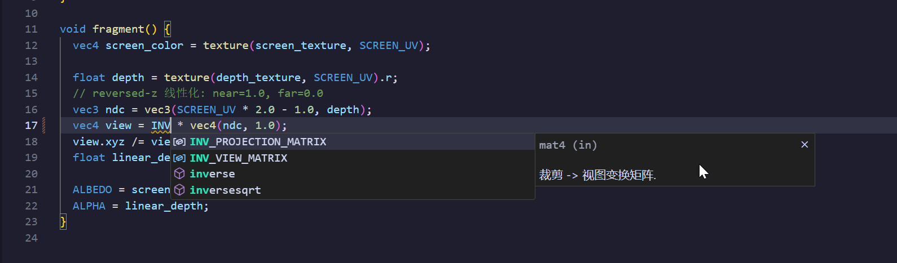
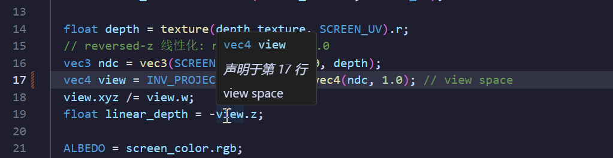

# GDShader Support for VS Code









---

## ✨ 功能概览

本插件为 **Godot 4.x** 的 GDShader 语言提供全方位的编辑器增强支持，覆盖从语法高亮到语义诊断的完整开发体验。

### 🎨 语法高亮

- 完整的 TMLanguage 语法定义，支持 `.gdshader` 和 `.gdshaderinc` 文件
- 覆盖所有关键字、类型、内置变量、运算符、注释和预处理指令

### 💡 智能代码补全

**上下文感知**的自动补全系统：

| 补全类别 | 说明 |
|---|---|
| `shader_type` 值 | `spatial`、`canvas_item`、`particles`、`sky`、`fog` |
| `render_mode` 选项 | 根据当前着色器类型自动过滤 |
| Uniform 提示 | 附带适用类型和说明文字 |
| 内置函数 | 附带签名和参数 snippet，按上下文过滤 |
| 内置变量 | 覆盖全部 **5 种着色器类型**，按处理器函数上下文过滤 |
| Swizzle 分量 | `.xyz` / `.rgb` / `.stpq` 等 |
| GLSL 类型与常量 | 完整的类型、关键字和常量支持 |

此外还支持通用后续语法要素匹配（如输入 `shader_type ` 后自动提示可选类型名）。

### 🔍 语义级语法诊断

提供超越纯文本检查的**语义级别**诊断能力：

- 缺少 `shader_type` 声明检测 & 无效着色器类型校验
- 大括号/圆括号不匹配检测（含跨行块注释的正确处理）
- 缺少分号警告
- **处理器函数约束检查** — 检测不适用于当前着色器类型的处理器函数
- **`discard` 位置检查** — 确保仅在 `fragment()` / `light()` 中使用
- **内置变量只读检查** — 检测对 `in` 模式内置变量的非法写入

### 📖 悬停提示

悬停任意符号即可查看详细文档：

- 内置函数签名、说明及上下文限制信息
- 类型信息与内置变量详情（含访问模式 `in` / `out` / `inout`）
- 常量值（`PI`、`TAU`、`E` 等）
- Uniform 提示详情（含适用类型列表）
- 跨处理器函数上下文的变量提示

### 🎨 颜色预览

- `vec3(r, g, b)` 和 `vec4(r, g, b, a)` 值的内联拾色器
- 点击即可可视化编辑颜色

### 📋 代码片段

| 类别 | 触发词 | 说明 |
|---|---|---|
| 着色器模板 | `shader_spatial`, `shader_canvas_item`, `shader_particles`, `shader_sky`, `shader_fog` | 对应 5 种着色器类型的完整模板 |
| Uniform 片段 | `uniform_range`, `uniform_color`, `uniform_texture`, `uniform_enum` | 常用 Uniform 声明片段 |
| 处理器函数 | `func_vertex`, `func_fragment`, `func_light` 等 | 各处理器函数骨架片段 |

### 🔧 格式化 & 命令

- **文档格式化**：自动规范化缩进
- **GDShader: 插入着色器模板** — 快速选择着色器类型并插入完整模板
- **GDShader: 预览颜色** — 显示光标处 `vec3` / `vec4` 的颜色信息

---

## 💬 Hint 注释

本插件支持通过 **特殊 hint 注释** 来帮助分析器更好地理解你的代码。这些注释写在 GDShader 源码中，仅对扩展生效，不影响实际着色器编译。

| Hint | 语法 | 说明 |
|---|---|---|
| **忽略** | `// #gdshader-hint-ignore` | 写在 `#include` 的**同行或下一行**，抑制该 include 的"资源路径无法解析"警告 |
| **重定向** | `// #gdshader-hint-redirection:./相对路径` | 写在 `res://` 路径的 `#include` **同行或下一行**，将 Godot 资源路径重定向为本地相对路径，使扩展能正确解析 |
| **类型提示** | `// #gdshader-hint-type:vec3`<br>`/* #gdshader-hint-type:vec3 */` | 为**前一个变量声明**指定类型。适用于类型无法自动推断的场景（如外部函数返回值） |
| **声明符号** | `// #gdshader-hint-declare:vec4 my_func(float p1, in float x);`<br>或<br>`// #gdshader-hint-declare:float MY_VAR;` | 向当前作用域注入一个**函数或变量定义**。支持函数（含参数）和简单变量。旧名称 `#gdshader-hint-def` 同样兼容 |
| **声明宏** | `// #gdshader-hint-define:MY_FLAG`<br>`// #gdshader-hint-define:SQR(x) ((x)*(x))` | 声明一个宏符号（等价于 `#define`）。用于外部预定义（如由 Godot 引擎在编译时注入）的宏，让分析器识别它们 |

### 使用示例

```glsl
// ── #include 重定向 & 忽略 ──
#include "res://shaders/utils.gdshaderinc" // #gdshader-hint-redirection:./utils.gdshaderinc
#include "res://third_party/something.gdshaderinc" // #gdshader-hint-ignore

// ── 类型提示 ──
var custom_data = get_custom_data(); // #gdshader-hint-type:vec3

// ── 声明一个函数 ──
// #gdshader-hint-declare:vec4 blend_overlay(vec4 base, vec4 overlay);

// ── 声明一个变量 ──
// #gdshader-hint-declare:float GLOBAL_SCALE;

// ── 声明宏 ──
// #gdshader-hint-define:MAX_STEPS 64
// #gdshader-hint-define:SQR(x) ((x)*(x))
```

> **说明：** 所有 hint 注释均支持行注释（`// ...`）和块注释（`/* ... */`）两种写法。对于 `#gdshader-hint-ignore` 和 `#gdshader-hint-redirection`，注释可写在 `#include` 的**行尾**或**下一行**。

### 条件编译块

插件会识别 `#ifdef` / `#ifndef` / `#if` / `#elif` / `#else` / `#endif` 指令，并提供以下检查：

- **配对检查**：未闭合的 `#ifdef` / `#ifndef` / `#if`，或孤立的 `#else` / `#elif` / `#endif` 会被报错
- **顺序检查**：`#elif` 不能出现在 `#else` 之后；同一条件块内不能有多个 `#else`
- **符号提取**：即使 `#define` 写在 `#ifdef` 内部，宏仍会被分析器识别为可用符号（插件不进行条件求值）

```glsl
#ifdef USE_HQ
#define SAMPLES 16
#else
#define SAMPLES 4
#endif

void fragment() {
  for (int i = 0; i < SAMPLES; i++) { /* ... */ }
}
```

### 文档注释

插件同时支持两种 Doxygen 风格的文档注释 (以 markdown 格式解析)，写在函数声明之上会在悬停提示中自动渲染：

- `///` 连续行注释
- `/** ... */` 块注释

支持的标签：`@param`、`@return`、`@brief`、`@note`、`@warning`、`@see`、`@deprecated`、`@throws`、`@since`、`@author`、`@version`。

```glsl
/**
 * 计算向量长度的平方。
 * - @param v 输入向量
 * - @return 长度的平方
 */
float len_sq(vec3 v) { return dot(v, v); }
```

## 🚀 快速开始

1. 打开 `.gdshader` 或 `.gdshaderinc` 文件，插件自动激活
2. 输入时即可看到智能补全提示，悬停符号查看文档

> 所有功能均可通过设置项独立开关：
> - `gdshader.diagnostics.enabled`
> - `gdshader.completion.enabled`
> - `gdshader.hover.enabled`
> - `gdshader.format.enabled`

## 🏗 架构设计

插件采用**数据驱动架构**，语言数据与逻辑代码分离：

```
src/
├── data/          ← 数据层：语言数据表（可独立扩展）
│   ├── keywords.ts
│   ├── render-modes.ts
│   ├── builtin-functions.ts
│   ├── builtin-vars.ts
│   └── ...
└── providers/     ← 功能层：编辑器功能实现
    ├── completionProvider.ts    → 上下文感知补全
    ├── hoverProvider.ts         → 悬停提示
    ├── diagnosticsProvider.ts   → 语义诊断
    ├── formattingProvider.ts    → 格式化
    └── colorProvider.ts         → 颜色预览
```

**增补数据只需编辑对应的数据表文件，无需修改 provider 逻辑。**

## 支持的文件格式

| 扩展名 | 说明 |
|---|---|
| `.gdshader` | GDShader 源文件 |
| `.gdshaderinc` | GDShader 包含文件 |

## 开发

```bash
# 安装依赖
npm install

# 编译
npm run compile

# 监听模式
npm run watch

# 在 VS Code 中按 F5 启动 Extension Development Host 进行调试
```

详细开发文档请参阅 [./docs/](./docs/) 目录。

## 许可证

[MIT](./LICENSE)
